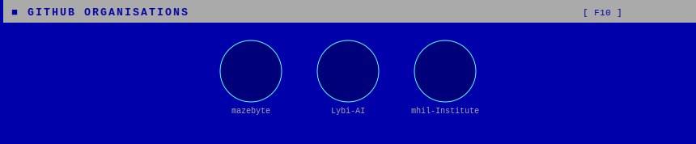

<!-- ══════════════════════════════════════════════════════════════ -->
<!--  NETANEL ELIAV — GitHub Profile README                       -->
<!--  Auto-updated daily by GitHub Action                         -->
<!-- ══════════════════════════════════════════════════════════════ -->

<!-- ── ABOUT ──────────────────────────────────────────────────── -->

<!-- ── TECH STACK ──────────────────────────────────────────────── -->

<!-- ── GITHUB STATS ─────────────────────────────────────────────── -->

<!-- ── ORGANISATIONS — regenerated daily by Action ──────────────────── -->

<!-- ── ARTICLES — regenerated daily by Action ────────────────────── -->

<!-- ── PROJECTS — regenerated daily by Action ────────────────────── -->

<!-- ── CONTACT — regenerated daily by Action ─────────────────────── -->

<!-- ── FOOTER ─────────────────────────────────────────────────────── -->

