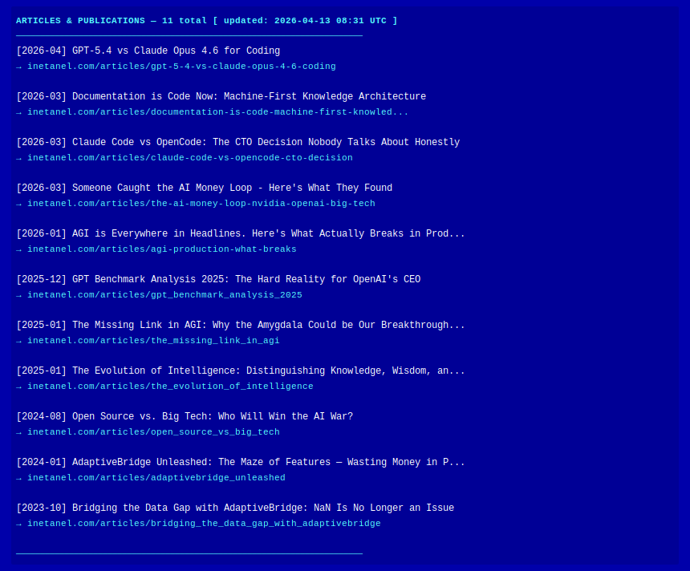

<!-- ══════════════════════════════════════════════════════════════ -->
<!--  NETANEL ELIAV — GitHub Profile README                       -->
<!--  Stats + Articles + Projects: auto-updated daily by Action   -->
<!-- ══════════════════════════════════════════════════════════════ -->

<div align="center"></div>
<div align="center"></div>

<!-- ── ABOUT ──────────────────────────────────────────────────── -->
<div align="center"></div>

```
SYSTEM IDENTITY
───────────────────────────────────────────────────────────────────────
Name    : Netanel Eliav
Role    : AI Expert · Startup Mentor · Tech Advisor · CTO
Location: United Kingdom (Global)
Website : https://inetanel.com
Status  : [ ONLINE ] — Open to collaborations & advisory roles
───────────────────────────────────────────────────────────────────────
Bio     : Infusing life's vibrance into technological craft.
          Building projects that push boundaries before they hit
          the market. Forbes · 60 Leaders on AI · Silicon Review.
```

<div align="center">

[](https://inetanel.com)&nbsp;[](https://inetanel.com/articles)&nbsp;[](https://inetanel.com/lifemap)&nbsp;[](https://inetanel.com/contact)

</div>

<!-- ── TECH STACK ──────────────────────────────────────────────── -->
<div align="center"></div>

**`[ AI & Machine Learning ]`**

&nbsp;&nbsp;&nbsp;&nbsp;&nbsp;

**`[ Web & Backend ]`**

&nbsp;&nbsp;&nbsp;&nbsp;&nbsp;

**`[ Cloud & DevOps ]`**

&nbsp;&nbsp;&nbsp;&nbsp;

<!-- ── GITHUB STATS ─────────────────────────────────────────────── -->
<div align="center"></div>

<div align="center">

<!-- STATS-BADGES:START -->
&nbsp;&nbsp;&nbsp;&nbsp;
<!-- STATS-BADGES:END -->

<br/>


[](https://github.com/inetanel)

</div>

<!-- ── ARTICLES ────────────────────────────────────────────────── -->
<div align="center"></div>

<!-- ARTICLES:START -->
<div align="center"></div>
<!-- ARTICLES:END -->

<div align="center">

[](https://inetanel.com/articles)

</div>

<!-- ── PROJECTS ────────────────────────────────────────────────── -->
<div align="center"></div>

<!-- PROJECTS:START -->
<div align="center"></div>
<!-- PROJECTS:END -->

<!-- ── CONTACT ─────────────────────────────────────────────────── -->
<div align="center"></div>

<!-- CONTACT:START -->
<div align="center"></div>
<!-- CONTACT:END -->

<!-- ── FOOTER ─────────────────────────────────────────────────── -->

```
BIO(S) Version v1.90AI | Model 0.12.2 | © Netanel Eliav | inetanel.com
```
