<!-- ══════════════════════════════════════════════════════════════ -->
<!--  NETANEL ELIAV — GitHub Profile README                       -->
<!--  Auto-updated daily by GitHub Action                         -->
<!-- ══════════════════════════════════════════════════════════════ -->

<!-- ── ABOUT ──────────────────────────────────────────────────── -->

&nbsp;&nbsp;&nbsp;

<!-- ── TECH STACK ──────────────────────────────────────────────── -->

&nbsp;&nbsp;&nbsp;&nbsp;&nbsp;&nbsp;&nbsp;&nbsp;&nbsp;&nbsp;&nbsp;&nbsp;

<!-- ── GITHUB STATS ─────────────────────────────────────────────── -->

<!-- STATS-BADGES:START -->
<<<<<<< HEAD

=======
&nbsp;&nbsp;&nbsp;&nbsp;
>>>>>>> 19dd483 (Update)
<!-- STATS-BADGES:END -->

<!-- ── ARTICLES — regenerated daily by Action ────────────────────── -->

<<<<<<< HEAD

<!-- ARTICLES:START -->

<a href="https://inetanel.com/articles/gpt-5-4-vs-claude-opus-4-6-coding">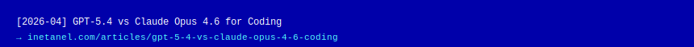</a>
<a href="https://inetanel.com/articles/documentation-is-code-machine-first-knowledge-architecture">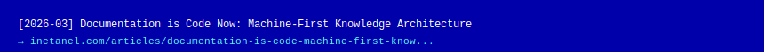</a>
<a href="https://inetanel.com/articles/claude-code-vs-opencode-cto-decision">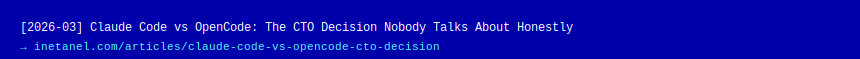</a>
<a href="https://inetanel.com/articles/the-ai-money-loop-nvidia-openai-big-tech">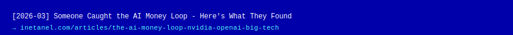</a>
<a href="https://inetanel.com/articles/agi-production-what-breaks">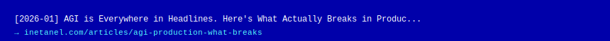</a>
<a href="https://inetanel.com/articles/gpt_benchmark_analysis_2025">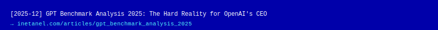</a>
<a href="https://inetanel.com/articles/the_missing_link_in_agi">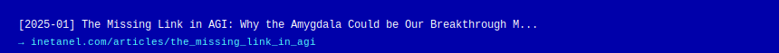</a>
<a href="https://inetanel.com/articles/the_evolution_of_intelligence">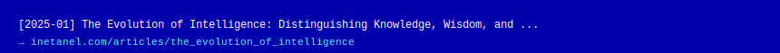</a>
<a href="https://inetanel.com/articles/open_source_vs_big_tech">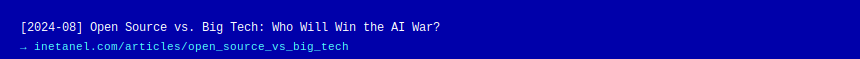</a>
<a href="https://inetanel.com/articles/adaptivebridge_unleashed">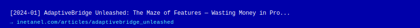</a>
<a href="https://inetanel.com/articles/bridging_the_data_gap_with_adaptivebridge">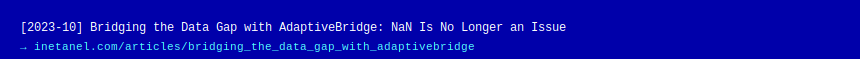</a>

<!-- ARTICLES:END -->

=======
>>>>>>> 19dd483 (Update)

<!-- ── PROJECTS — regenerated daily by Action ────────────────────── -->

<<<<<<< HEAD
<!-- PROJECTS:START -->

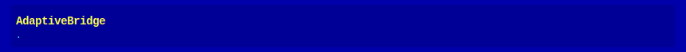

<!-- PROJECTS:END -->

<!-- ── CONTACT ─────────────────────────────────────────────────── -->
=======
<!-- ── CONTACT — regenerated daily by Action ─────────────────────── -->
>>>>>>> 19dd483 (Update)

<!-- ── FOOTER ─────────────────────────────────────────────────────── -->

